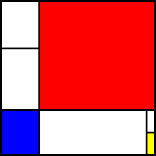

mpdl-py
=======

MPDL interpreter for Python

MPDL
----

MPDL (Mondrian Painting Description Language) is an esoteric language
`created by Arnaud Marguerat`_ to describe `Piet Mondrian`_ abstract paintings.

.. _`created by Arnaud Marguerat`: https://codegolf.stackexchange.com/questions/40741/mondrian-painting-description-language
.. _`Piet Mondrian`: https://en.wikipedia.org/wiki/Piet_Mondrian

Syntax
~~~~~~

MPDL operates on a stack of rectangles and outputs a square image. The stack
is initialised with a single rectangle filling the whole image. There are 3
commands:

1. ``v<integer 0-100>``: Pop a rectangle and split it vertically at the
   position given by the argument as percentage, rounded down. Push the left
   and right rectangles, in this order.

2. ``h<integer 0-100>``: Split horizontally. Push the top and bottom
   rectangles, in this order.

3. ``c<integer 1-4>``: Pop a rectangle and paint it a colour:
   
   - 1: white
   
   - 2: red
   
   - 3: blue
   
   - 4: yellow

Rectangles are drawn with a black border.

Example
~~~~~~~

The sample program::

    v25 h71 v93 h50 c4 c1 c1 c2 h71 c3 h44 c1 c1

run with canvas size 256px and border width 3px, outputs

How to install
--------------

Installing from distribution
~~~~~~~~~~~~~~~~~~~~~~~~~~~~

It's usually easiest to get the package from the pip repository::

    pip install mpdl

Installing from source
~~~~~~~~~~~~~~~~~~~~~~~

To install from source, clone the source repo and run the setup script::

    git clone https://github.com/LeopoldTal/mpdl-py.git
    cd mpdl-py
    pip install -e .

Running the tests
~~~~~~~~~~~~~~~~~

Run tests in the root directory with::

    py.test

To generate a coverage report::

    py.test --cov --cov-branch --cov-report=term-missing

How to use
----------

Usage::

    mpdl [-o OUT] [-s SIZE] [-b BORDER] path/to/source_file.mpdl

Outputs an ASCII PPM image with colour depth 1.

Arguments:

- ``-o``: Path to output file. Default ``out.ppm``.
- ``-s``: Side length of square image in pixels. Default 256.
- ``-b``: Thickness of rectangle borders in pixels. Default 3.

Licence
-------

MIT. See LICENSE_ file.

.. _LICENSE: LICENSE

Credits
-------

Developer
~~~~~~~~~

mpdl-py is developed by `Leopold T. de Gaillande`_.

.. _`Leopold T. de Gaillande`: https://github.com/LeopoldTal/

Language author
~~~~~~~~~~~~~~~

MPDL is the work of `Arnaud Marguerat`_.

.. _`Arnaud Marguerat`: https://codegolf.stackexchange.com/users/13798/arnaud

Dependencies
~~~~~~~~~~~~

* setuptools_
* argparse_
* pytest_
* unittest_

.. _setuptools: https://setuptools.readthedocs.io/en/latest/
.. _argparse: https://docs.python.org/3/library/argparse.html
.. _pytest: https://docs.pytest.org/en/latest/
.. _unittest: https://docs.python.org/3/library/unittest.html
